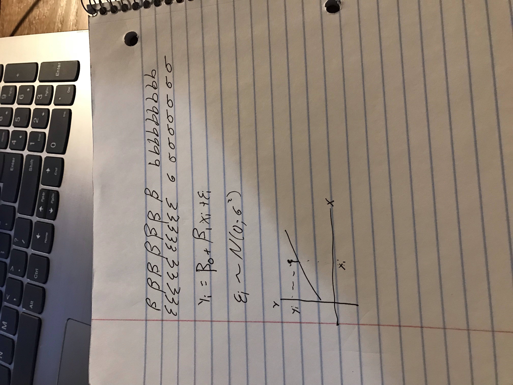

## Instructions

1. Study Sections 1-5 of Chapter 1 -- "Linear Regression with One Predictor Variable."    
<span id=note>(You may also choose to study Sections 6-8 if you are interested in the theory behind regression.)</span>

2. Attempt and submit at least <span id=recpoints style="padding-left:0px;">{24}</span> Hard Work Points by Saturday at 11:59 PM.    
<span id=note>Over <span id=points style="padding-left:0px;">{30}</span> gets you {+1} Final Exam Point.</span>    
<span id=note>Over <span id=points style="padding-left:0px;">{40}</span> gets you {+2} Final Exam Points.</span>    
<span id=note>Over <span id=points style="padding-left:0px;">{50}</span> gets you {+3} Final Exam Points.</span>

<span id=recpoints>{...}</span> are "Recommended" and will earn you the minimum points required. 

<span id=points>{...}</span> are optional, but the more of these you complete, the better.

The format of reporting your score on each problem is: 

**\{ Attempted Points "A=" | Earned Points "E=" \}**

* **Attempted Points**: You gave the problem your time and energy, but aren't sure if you are completing the problem correctly or not. You will be graded on what you attempt.
* **Earned Points**: You are confident you have completed the problem correctly by comparing your work to the [Student Solutions](http://fac.ksu.edu.sa/sites/default/files/1_58.pdf), other students in class, or the examples in the book. This should always be less than or equal to **Attempted Points**. 

By marking points in this way, your teacher can identify problems that you are working on, but having difficulty with, and can help you and the class better understand those concepts.

<br/>

## Reading Points <span id=headpoints>{21} Possible</span>

### Section 1.1 <span id=recpoints>{3}</span><span id=report>{ A=3 | E=2 }</span>


### Section 1.2 <span id=recpoints>{3}</span><span id=report>{ A=3 | E=2 }</span>


### Section 1.3 <span id=recpoints>{3}</span><span id=report>{ A=3 | E=2 }</span>


### Section 1.4 <span id=recpoints>{2}</span><span id=report>{ A=2 | E=1 }</span>


### Section 1.5 <span id=recpoints>{2}</span><span id=report>{ A=2 | E=1 }</span>


### Section 1.6 <span id=points>{3}</span><span id=report>{ A=0 | E=0 }</span>


### Section 1.7 <span id=points>{2}</span><span id=report>{ A=0 | E=0 }</span>


### Section 1.8 <span id=points>{3}</span><span id=report>{ A=0 | E=0 }</span>


<br/>

## Theory Points <span id=headpoints>{11} Possible</span>


### Problem 1 <span id=recpoints>{3}</span><span id=report>{ A=3 | E=2 }</span>

Recreate this chalkboard in your own handwriting 
 

<!-- Uncomment the code below, and insert your own picture file path to load the picture of your version of this chalkboard.-->

  
 

### Problems 1.29 and 1.30 <span id=points>{2}</span><span id=report>{ A=0 | E=0 }</span>
 
### Problem 1.32 <span id=points>{2}</span><span id=report>{ A=0 | E=0 }</span>
 
### Problem 1.33 <span id=points>{4}</span><span id=report>{ A=0 | E=0 }</span>
 
### Problem 1.34 <span id=points>{3}</span><span id=report>{ A=0 | E=0 }</span>


<br/> 

## Application Points <span id=headpoints>{19} Possible</span>


<a id=datalink target="_blank" href=http://www.stat.ufl.edu/~rrandles/sta4210/Rclassnotes/data/textdatasets/index.html>Download Data Files</a>


### Problem 1.19 <span id=recpoints>{4}</span><span id=report>{ A=4 | E=2 }</span>

```{r getp19}
# Load the Problem 1.19 Data into the object "p1.19":
p1.19 <- read.table("http://www.stat.ufl.edu/~rrandles/sta4210/Rclassnotes/data/textdatasets/KutnerData/Chapter%20%201%20Data%20Sets/CH01PR19.txt")

# Rewrite the column names to be "Y" and "X" to match the textbook:
colnames(p1.19) <- c("Y","X")
```

```{r}
library(tidyverse)

my_lm <- lm(Y~X, data = p1.19)

#2.11404929+0.03882713*x = y


my_coef <- coef(my_lm)
View(my_coef)

plot(my_lm)

p1.19 %>% 
  mutate(pred = coef(my_lm)[1]+coef(my_lm)[2] * X) %>% 
  ggplot()+
  geom_point(aes(x=X, y = Y))+
  geom_line(aes(x=X,y=pred))

coef(my_lm)[2]
```


### Problem 1.20 <span id=recpoints>{4}</span><span id=report>{ A=4 | E=3 }</span> 

```{r getp20}
# Load the Data:
p1.20 <- read.table("http://www.stat.ufl.edu/~rrandles/sta4210/Rclassnotes/data/textdatasets/KutnerData/Chapter%20%201%20Data%20Sets/CH01PR20.txt")

# Rewrite the column names to be "Y" and "X" to match the textbook:
colnames(p1.20) <- c("Y","X")
```

```{r}
my_lm2 <- lm(Y~X, data = p1.20)

#-.5801567+15.0352480 * x = y


my_coef2 <- coef(my_lm2)
View(my_coef2)

plot(my_lm2)

p1.20 %>% 
  mutate(pred = coef(my_lm2)[1]+coef(my_lm2)[2] * X) %>% 
  ggplot()+
  geom_point(aes(x=X, y = Y))+
  geom_line(aes(x=X,y=pred))

coef(my_lm2)[2]

#c. gives you information but it is not well understood and does not make sense with it being negative. 

#D. 75
```


### Problem 1.21 <span id=points>{4}</span><span id=report>{ A=0 | E=0 }</span> 

```{r getp21}
# Load the Data:
p1.21 <- read.table("http://www.stat.ufl.edu/~rrandles/sta4210/Rclassnotes/data/textdatasets/KutnerData/Chapter%20%201%20Data%20Sets/CH01PR21.txt")

# Rewrite the column names to be "Y" and "X" to match the textbook:
colnames(p1.21) <- c("Y","X")
```


### Problem 1.22 <span id=points>{3}</span><span id=report>{ A=0 | E=0 }</span> 

```{r getp22}
# Load the Data:
p1.22 <- read.table("http://www.stat.ufl.edu/~rrandles/sta4210/Rclassnotes/data/textdatasets/KutnerData/Chapter%20%201%20Data%20Sets/CH01PR22.txt")

# Rewrite the column names to be "Y" and "X" to match the textbook:
colnames(p1.22) <- c("Y","X")
```


### Problem 1.27 <span id=points>{2}</span><span id=report>{ A=0 | E=0 }</span>

```{r getp27}
# Load the Data:
p1.27 <- read.table("http://www.stat.ufl.edu/~rrandles/sta4210/Rclassnotes/data/textdatasets/KutnerData/Chapter%20%201%20Data%20Sets/CH01PR27.txt")

# Rewrite the column names to be "Y" and "X" to match the textbook:
colnames(p1.27) <- c("Y","X")
```


### Problem 1.28 <span id=points>{2}</span><span id=report>{ A=0 | E=0 }</span>

```{r getp28}
# Load the Data:
p1.28 <- read.table("http://www.stat.ufl.edu/~rrandles/sta4210/Rclassnotes/data/textdatasets/KutnerData/Chapter%20%201%20Data%20Sets/CH01PR28.txt")

# Rewrite the column names to be "Y" and "X" to match the textbook:
colnames(p1.28) <- c("Y","X")
```


 


<style>
#points {
  font-size:1em;
  padding-left:15px;
  font-weight:bold; 
  color:#317eac;
}

#recpoints {
  font-size:1em;
  padding-left:15px;
  font-weight:bold; 
  color:#7eac31;
}

#report {
  font-size:.7em;
  padding-left:15px;
  font-weight:normal; 
  color:#5a5a5a;
}

#datalink {
  font-size:.8em;
  color:#317eac;
  padding-left:5px;
}

#note {
  font-size:.8em;
  color:#787878;
}

#headpoints {
 font-size:12pt;
 color: #585858; 
 padding-left: 15px;
}
</style>
 

 

 